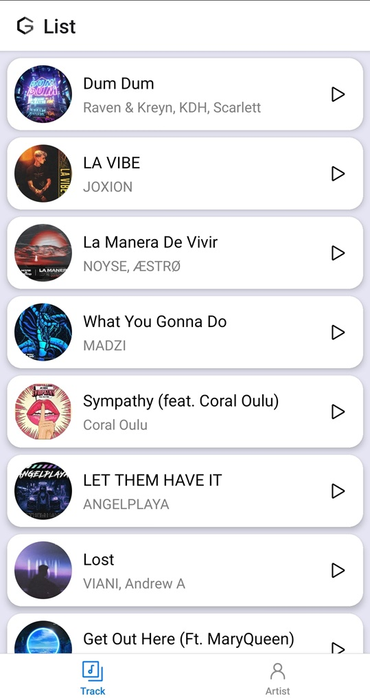
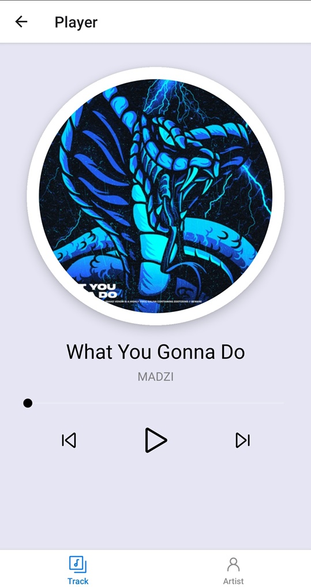
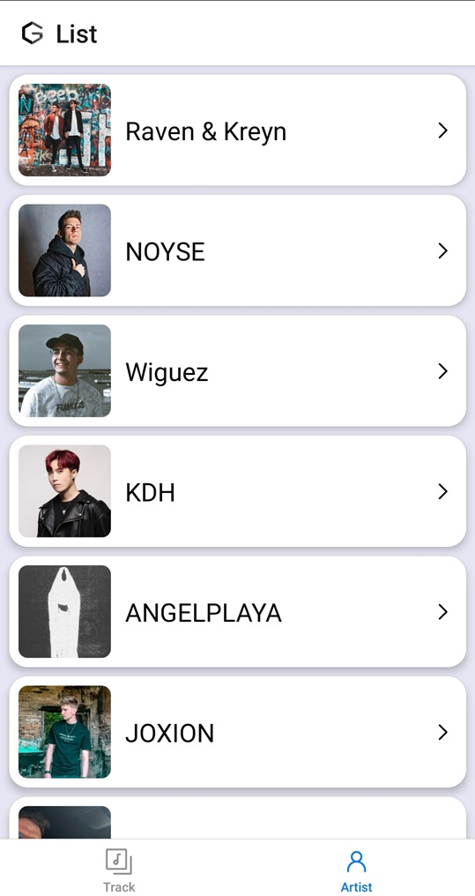
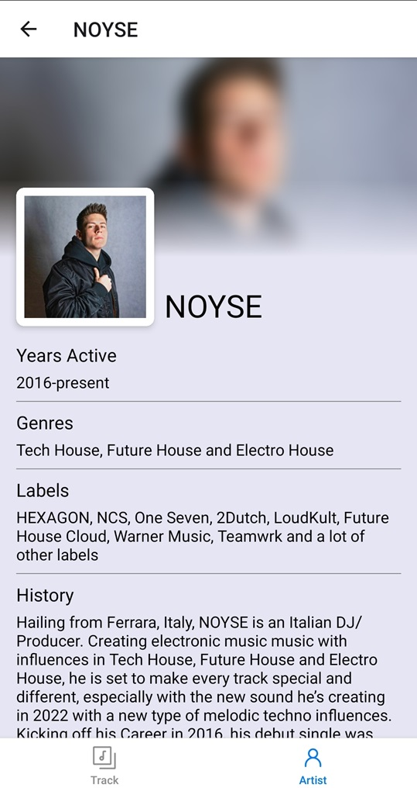

<h1 align="center">
  <picture>
    <source media="(min-width: 425px)" srcset="./demo/header/header.svg">
    
  </picture>
</h1>

<p align="center">
  <a href="https://code.visualstudio.com/">
    
  </a>
  <a href="https://jsdoc.app/">
    
  </a>
  <a href="">
    
  </a>
</p>

GSound is a music player for mobile devices.

> **Note:** this app is tested on **Android** devices.

## Demo

<details>
  <summary>Screenshot</summary>

|                   Track list                    |                      Player                       |
| :---------------------------------------------: | :-----------------------------------------------: |
|   |         |
|                   Artist list                   |                   Artist detail                   |
|  |  |

</details>

## How to run

> **Note**: Make sure you have installed the [`environment`](https://reactnative.dev/docs/set-up-your-environment).

- Step 1: clone this repo.
- Step 2: move to project directory.
- Step 3: intall library.
  ```
  npm install
  ```
- Step 4: run the app on an emulator or device.
  ```
  npm start
  ```

Yayyyyyyyyy, it's finally done and enjoy this app, have fun q(≧▽≦q)
